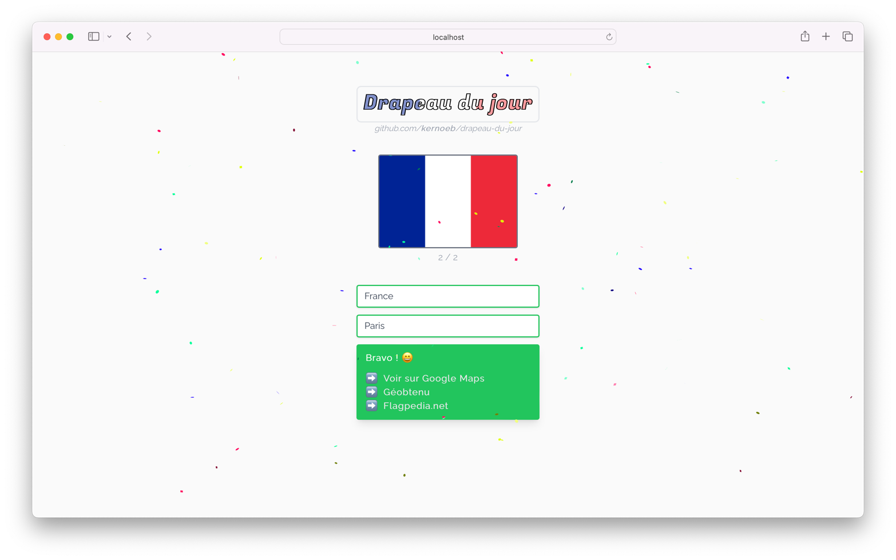

<h1 align="center">
  <br>
  <a href="https://drapeaudujour.noewen.com/"></a>
  <br>
  Drapeau du jour
  <br>
</h1>
 


> Vue 3 + Vite + Node.js


### Before you start

Create a `daily.json` file in the root of your project.

```json
{
  "2022-03-25": "fr",
  "2022-03-26": "de",
  "2022-03-27": "it"
}
```

### Deploy

```bash
docker-compose pull && docker-compose up -d --remove-orphans
```

### Reduce image size (optional)

```bash
docker-slim build --target ddj-test --tag ddj2-test --include-path /app/dist --mount "$PWD"/dev/daily.json:/app/daily.json
```
